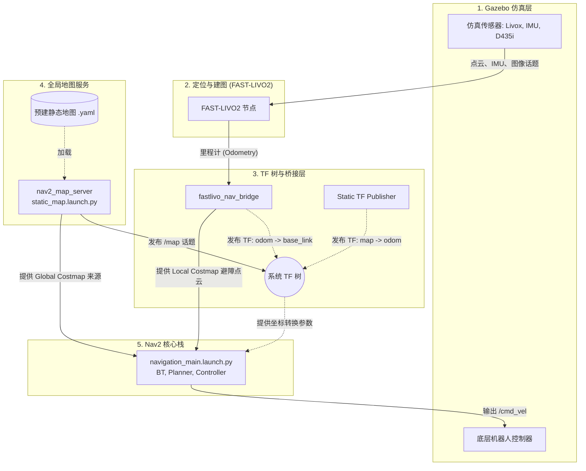

# Lite3 仿真导航系统架构与流程

本文档详细分析了 Lite3 四足机器人仿真环境下的导航验证流程，并提供了系统结构与数据流的说明。本分析基于库内的 `run_navigation_validation.sh` 脚本及依赖配置得出。

## 1. 系统整体架构

整个导航系统主要由以下几个核心模块构成：

1. **Gazebo 仿真环境**：提供机器人动力学仿真以及传感器数据的输出（例如 Livox 激光雷达、IMU、D435i RGB 深度相机等），并接收控制指令。
2. **FAST-LIVO2 状态估计 (Localization)**：接收传感器输入数据，运行激光-惯性-视觉联合里程计（Lidar-Inertial-Visual Odometry），输出高精度的机器人位姿和里程计数据。
3. **Bridge 层 (fastlivo_nav_bridge)**：作为算法输出与标准 Nav2 架构之间的桥梁，主要用于处理 FAST-LIVO2 输出的位姿、TF 树关系以及点云格式，将其转换为 Nav2 兼容的标准数据（例如发布标准的 `odom -> base_link` TF 关系并将定制化点云转为 Costmap 支持的格式）。
4. **地图服务与静态 TF (Mapping & TF)**：主要通过 `nav2_map_server` 加载预先构建好的 2D 静态地图，并利用临时静态 TF 节点建立全局 `map` 坐标系到 `odom` 坐标系的关系，供 Nav2 用于全局规划。
5. **Nav2 导航栈 (Navigation2)**：接收全局静态地图及传感器观测数据，进行全局路径规划（Planner）、局部避障（Controller）及行为树控制（BT），最终解算得出输出给机器人的 `/cmd_vel` 速度指令。

## 2. 导航流程图

系统各节点的作用以及数据流向的交互关系如下：

## 3. 启动流程解析

在执行 `run_navigation_validation.sh` 一键导航验证脚本时，系统严格按照依赖关系逐步拉起所需的节点（各阶段之间的 `DELAY` 用于确保节点完成初始化以防 TF 丢失或报错）：

1. **`run_gazebo_world.sh`**：最基础的物理仿真环境拉起，开始发布仿真传感器数据和基础关节变化。
2. **`FAST-LIVO2`**：定位模块启动。开始处理各类传感器流进行定位与建图计算。
3. **`fastlivo_nav_bridge`**：桥接节点启动，开始消化并把 FAST-LIVO2 独有的数据结构转交给 ROS 2 常规导航所期望的 Topic 和 TF 格式。
4. **`static_map.launch.py`**：启动 `nav2_map_server` 并通过生命周期管理（Lifecycle Manager）激活地图发布功能。
5. **临时 `map -> odom` TF**：由于本例中尚未引入动态的 AMCL 节点将 `map` 对准 `odom`，因此脚本直接使用一个临时的标准静态 TF 拉起两个坐标系建立约束关系。
6. **`navigation_main.launch.py`**：作为最后的处理枢纽，启动所有 Nav2 导航关键节点。
7. **启动 RViz 显示界面**：为操作者提供下发 2D Nav Goal 的可视化交互界面，完成最终的业务闭环。
